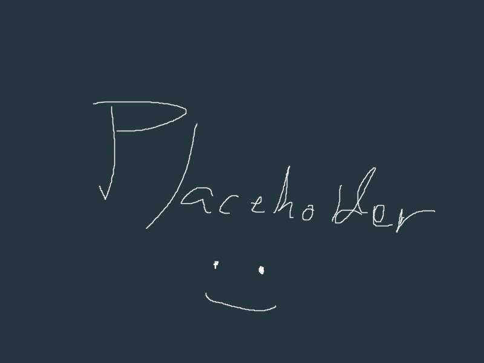

[![Contributors][contributors-shield]][contributors-url]
[![Forks][forks-shield]][forks-url]
[![Stargazers][stars-shield]][stars-url]
[![Issues][issues-shield]][issues-url]
[![LinkedIn][linkedin-shield]][linkedin-url]

<!-- PROJECT LOGO -->
 

  

<h3 align="center">DocRevu</h3>

  

    A free, open-source web application to store, revise, manage, and share complex documents with others. 
     
    <a href="https://github.com/tacbodell/DocRevu"><strong>Explore the docs »</strong></a>
     
     
    <a href="https://github.com/tacbodell/DocRevu">View Demo</a>
    ·
    <a href="https://github.com/tacbodell/DocRevu/issues/new?labels=bug&template=bug-report---.md">Report Bug</a>
  

<!-- TABLE OF CONTENTS -->

  
Table of Contents

  <ol>
    <li>
      <a href="#about-the-project">About The Project</a>
      <ul>
        <li><a href="#built-with">Built With</a></li>
      </ul>
    </li>
    <li><a href="#usage">Usage</a></li>
    <li><a href="#roadmap">Roadmap</a></li>
    <li><a href="#contributing">Contributing</a></li>
    <li><a href="#contact">Contact</a></li>
    <li><a href="#acknowledgments">Acknowledgments</a></li>
  </ol>

<!-- ABOUT THE PROJECT -->
## About The Project

(<a href="#readme-top">back to top</a>)

### Built With

* [![Javascript][js.js]][JS-url]
* [![React][React.js]][React-url]
* [![Node][Node.js]][Node-url]
* [![SQL][mysql.com]][SQL-url]
* [![MongoDB][mongodb.com]][MongoDB-url]

(<a href="#readme-top">back to top</a>)

<!-- ROADMAP -->
## Roadmap

- [ ] Upload, view, download, and delete documents
- [ ] Push revisions to documents with listed changes
- [ ] User login system
- [ ] Open groups to collaborate with others on projects

See the [open issues](https://github.com/tacbodell/DocRevu/issues) for a full list of proposed features (and known issues).

(<a href="#readme-top">back to top</a>)

<!-- CONTRIBUTING -->
## Contributing

Contributions are what make the open source community such an amazing place to learn, inspire, and create. Any contributions you make are **greatly appreciated**.

If you have a suggestion that would make this better, feel free to fork the repo and create a pull request. You can also simply open an issue with the tag "enhancement".
Also, remember to give this project a star! Thank you so much!

1. Fork the Project
2. Create your Feature Branch (`git checkout -b feature/AmazingFeature`)
3. Commit your Changes (`git commit -m 'Add some AmazingFeature'`)
4. Push to the Branch (`git push origin feature/AmazingFeature`)
5. Open a Pull Request

(<a href="#readme-top">back to top</a>)

<!-- CONTACT -->
## Contact

Get in touch! - [@brysonc00ns](https://twitter.com/brysonc00ns) - coonsbrysona@gmail.com

Project Link: [https://github.com/tacbodell/DocRevu](https://github.com/tacbodell/DocRevu)

(<a href="#readme-top">back to top</a>)

<!-- MARKDOWN LINKS & IMAGES -->
<!-- https://www.markdownguide.org/basic-syntax/#reference-style-links -->
[contributors-shield]: https://img.shields.io/github/contributors/tacbodell/DocRevu.svg?style=for-the-badge
[contributors-url]: https://github.com/tacbodell/DocRevu/graphs/contributors
[forks-shield]: https://img.shields.io/github/forks/tacbodell/DocRevu.svg?style=for-the-badge
[forks-url]: https://github.com/tacbodell/DocRevu/network/members
[stars-shield]: https://img.shields.io/github/stars/tacbodell/DocRevu.svg?style=for-the-badge
[stars-url]: https://github.com/tacbodell/DocRevu/stargazers
[issues-shield]: https://img.shields.io/github/issues/tacbodell/DocRevu.svg?style=for-the-badge
[issues-url]: https://github.com/tacbodell/DocRevu/issues
[license-shield]: https://img.shields.io/github/license/tacbodell/DocRevu.svg?style=for-the-badge
[license-url]: https://github.com/tacbodell/DocRevu/blob/master/LICENSE.txt
[linkedin-shield]: https://img.shields.io/badge/-LinkedIn-black.svg?style=for-the-badge&logo=linkedin&colorB=555
[linkedin-url]: https://linkedin.com/in/brysoncoons
[product-screenshot]: images/placeholder.png
[Node.js]: https://img.shields.io/badge/NodeJS-grey?style=for-the-badge&logo=node.js
[Node-url]: https://nodejs.org/en
[js.js]: https://img.shields.io/badge/Javascript-grey?style=for-the-badge&logo=javascript
[JS-url]: https://developer.mozilla.org/en-US/docs/Learn/Getting_started_with_the_web/JavaScript_basics
[React.js]: https://img.shields.io/badge/React-20232A?style=for-the-badge&logo=react&logoColor=61DAFB
[React-url]: https://reactjs.org/
[mysql.com]: https://img.shields.io/badge/MySQL-grey?style=for-the-badge&logo=mysql
[SQL-url]: https://www.mysql.com/
[mongodb.com]: https://img.shields.io/badge/MongoDB-grey?style=for-the-badge&logo=mongodb
[MongoDB-url]: https://www.mongodb.com/